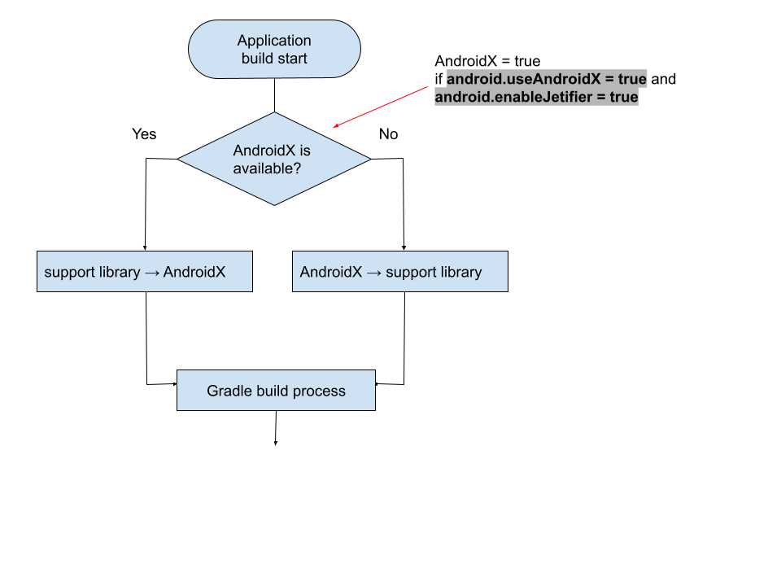

# Cordova AndroidX Build plugin

## What is this plugin?

Google introduced [AndroidX](https://developer.android.com/jetpack/androidx/migrate) libraries which replaces old [Android support libraries](https://developer.android.com/topic/libraries/support-library/index).

Since Cordova will introduce `AndroidX` from `cordova-android@9`, however your plugin needs to support both `with AndroidX` and `without AndroidX`.

This plugin migrates user's project code to `AndroidX` automatically when your plugin code is build at the time.
If the project does not specify `AndroidX`, this plugin migrates the user's project code migrates `Android Support Library`.

## How to use this plugin?

Just install this plugin

```
$ cordova plugin add cordova-androidx-build
```

Or use this plugin as dependency in your `plugin.xml`

```xml
<?xml version='1.0' encoding='utf-8'?>
<plugin ...>
  <platform name="android">
    ...
    <dependency id="cordova-androidx-build" />  <-- Add this line
  </platform>
</plugin>
```

## How does this plugin work?

The purpose of this plugin is `to build your plugin code` on any environments.
That's why this plugin has two migrates mode:

- If `AndroidX` is not available:
  this plugin changes the project code migrates to `support library`.

- If `AndroidX` is available:
  this plugin changed the project code migrates to `AndroidX`.




## What's the difference between `cordova-plugin-androidx-adapter`?

[cordova-plugin-androidx-adapter](https://github.com/dpa99c/cordova-plugin-androidx-adapter) migrates your plugin code to `AndroidX`.
This plugin also migrates your plugin code to `AndroidX`.

However `cordova-plugin-androidx-adapter` works on only your PC, because it uses `Cordova Hook Script` mechanism.
Because of this, `cordova-plugin-androidx-adapter` not cloud build services, such as `PhoneGap Build`.

This plugin is written in `Gradle` script, which **works on your PC or cloud build services**.


|                                  | cordova-plugin-androidx-adapter | cordova-androidx-build    |
|----------------------------------|---------------------------------|---------------------------|
| `support library` -> `AndroidX`  |  :white_check_mark:             | :white_check_mark:        |
| `support library` <- `AndroidX`  |  :x:                            | :white_check_mark:        |
| work on PC                       |  :white_check_mark:             | :white_check_mark:        |
| work on cloud services           |  :x:                            | :white_check_mark:        |
| when execute the process         |  after `cordova prepare`        | gradle sync               |
| mechanism                        |  `cordova hook script`          | gradle                    |
